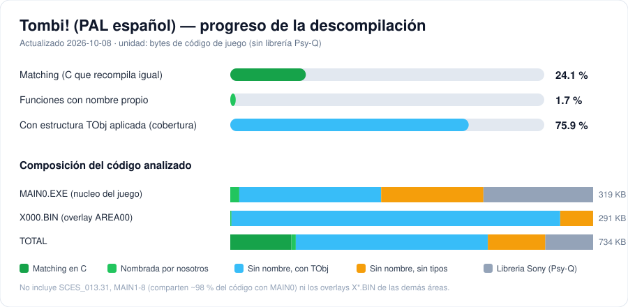
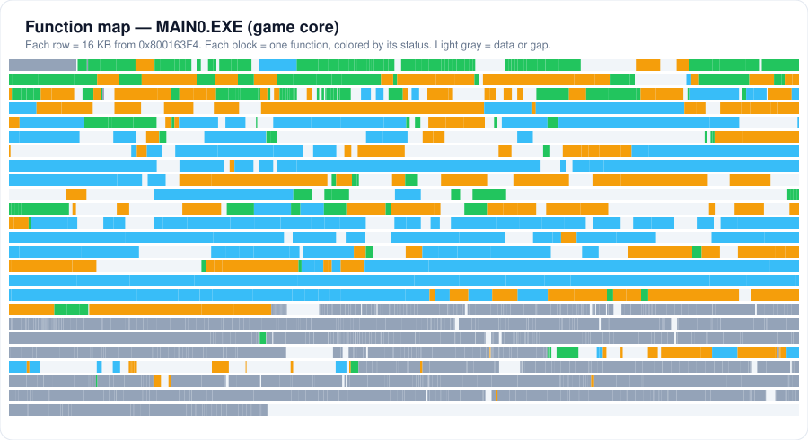
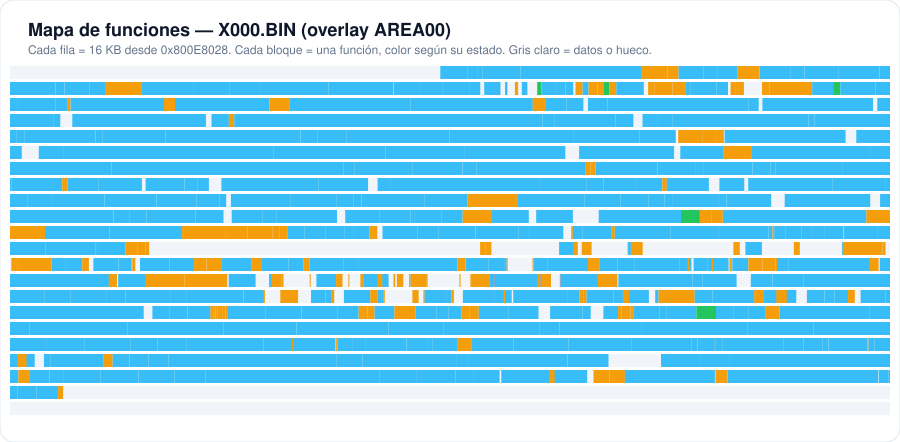

# Tombi! (Tomba!) — PlayStation decompilation

A work-in-progress **matching decompilation** of *Tombi!* (known as *Tomba!* in North America and
*Ore! Tomba* in Japan) for the original PlayStation. The goal is C source code that compiles, with the
game's original toolchain, into byte-identical machine code.

This repository targets the **European Spanish release** and works function by function: every
function in `src/` is verified to produce exactly the same instructions as the retail executable.

> This repository contains no game data, executables, disc images or Sony SDK files.
> You need your own legally obtained copy of the game and of the toolchain.

## Progress

<!-- progress:start -->
**Whole game: 46.3 % of the game's code matches byte for byte** (589572 of 1272064 bytes).

| Part | Code | Matching bytes | Matching |
|---|---:|---:|---|
| MAIN0.EXE: engine, shared by every area | 228328 B | 198220 B | 86.8 % `[#####################...]` |
| X000.BIN: AREA00 + object code reused by all areas | 297956 B | 294564 B | 98.9 % `[########################]` |
| X001..X019.BIN: code specific to the other areas | 745780 B | 96788 B | 13.0 % `[###.....................]` |
| **Whole game** | **1272064 B** | **589572 B** | **46.3 %** `[###########.............]` |

- Bytes of machine code in game functions; Sony's Psy-Q library (98992 B) is not counted.
- Each function counts once. The 16 area overlays share about 4800 functions with MAIN0/X000 or with each
  other; those copies match automatically and are not added again (counting every copy separately gives 82.7 %).
- Also tracked for MAIN0 + X000: 6.5 % of the code named by us, 75.9 % typed with the TObj structure.
<!-- progress:end -->



Function maps of MAIN0 and X000 (one block per function, coloured by status):





Per-program and per-area breakdown, pending work and what is not counted: [docs/PROGRESS.md](docs/PROGRESS.md).
Everything in this section is regenerated with `python3 tools/progress.py`.

## Target

| File | Description | SHA-1 |
|------|-------------|-------|
| `SCES_013.31` | Boot executable (PAL, Spanish) | `f6c383514e5d8367d2eed06400315cf6dd57ef6b` |
| `EXE/MAIN0.EXE` | Game core, loaded at `0x80010000` | `bec8dc5f4116f5e497f2337eef8c523ff6dee8fc` |
| `AREA00/X000.BIN` | Area overlay, loaded at `0x800E8028` | `ce168475f667f2ca8842eabad2aec829e301c5c5` |
| `AREA01/X001.BIN` | Area overlay, AREA01 (also AREA07), loaded at `0x800E8028` | `923f812dcfd7da18ee0f7017e5b45a5e38ee3015` |
| `AREA02/X002.BIN` | Area overlay, AREA02 (AREA19 ships a copy), loaded at `0x800E8028` | `646aa8b5ad97f70b299b982b3260f9f731a142bb` |
| `AREA03/X003.BIN` | Area overlay, AREA03, loaded at `0x800E8028` | `440ae76f5012e3778b908743d7d030c350caf7d3` |
| `AREA04/X004.BIN` | Area overlay, AREA04 (also AREA12), loaded at `0x800E8028` | `f01c882217efee45bf76aba54ee4fadfa6c25665` |
| `AREA05/X005.BIN` | Area overlay, AREA05, loaded at `0x800E8028` | `0d2778c0d4b3e5b5dfc40fc46053e46d9d785b17` |
| `AREA06/X006.BIN` | Area overlay, AREA06, loaded at `0x800E8028` | `1bd5b648feb75a580c14db6715e057cb035c1db1` |
| `AREA08/X008.BIN` | Area overlay, AREA08, loaded at `0x800E8028` | `5e098dccfd123af09967ca778c83223e8a21716d` |
| `AREA09/X009.BIN` | Area overlay, AREA09, loaded at `0x800E8028` | `1b44ea24890128c3d3789b0badb252135ba4dec1` |
| `AREA10/X010.BIN` | Area overlay, AREA10, loaded at `0x800E8028` | `5093e40399319f5987668bfb1d042713216d356e` |
| `AREA11/X011.BIN` | Area overlay, AREA11, loaded at `0x800E8028` | `016559470c5a253deb5a38f685ff312c39c2cb46` |
| `AREA13/X013.BIN` | Area overlay, AREA13, loaded at `0x800E8028` | `a4e8668eca85a32d6d0cdfa05ddffd6ad40bfbb0` |
| `AREA14/X014.BIN` | Area overlay, AREA14, loaded at `0x800E8028` | `4ee916eb3215ccae64773e1a9a547ab8dbcd1ff5` |
| `AREA16/X016.BIN` | Area overlay, AREA16, loaded at `0x800E8028` | `7c93915bc943e8d9d8fa5d5efbd02f7e563650e4` |
| `AREA17/X017.BIN` | Area overlay, AREA17, loaded at `0x800E8028` | `59c5964cbb4536bc62b1a65262d963fab1ad3d33` |
| `AREA18/X018.BIN` | Area overlay, AREA18, loaded at `0x800E8028` | `83eca42eb30944bb0c61056632b2ef7bb9891b34` |
| `AREA19/X019.BIN` | Area overlay, AREA19, loaded at `0x800E8028` | `94060c10f7b6e3af1adc55a0c9cff4b81890988c` |

The 17 area overlays (`X0nn.BIN`, Spanish; `X1nn`..`X8nn` are the other languages) are raw code blobs, all
loaded at `0x800E8028`. Their first 188 KB (`0x800E8028`..`0x80115EA4`: header, ~300 shared object handlers and
a data block) are byte-identical in every area; the rest is per-area code. X001..X019 are tracked like X000:
boundaries in `notes/functions_x0nn.csv`, sources in `src/x0nn/` (`// FUNC addr size X0nn`), and functions
identical to an already matched MAIN0/X000 function are generated by `tools/areas.py twins`.

`MAIN0.EXE` corresponds to `SCUS_942.36` of the NTSC-U release (same functions, shifted addresses).
See [notes/disc_layout.md](notes/disc_layout.md), [notes/memory_map_main0.md](notes/memory_map_main0.md)
and [notes/overlays.md](notes/overlays.md).

## How matching works

Each function lives in its own file, `src/<Name>.c`, with a small header:

```c
// FUNC 8001fddc 48 MAIN0        address, size, program
// MATCHING 8001fddc 48          added once the bytes match
```

Optional header lines: `// FLAGS -O2 -G0 ...` (compiler flags) and `// CC gcc-2.8.1` (compiler, by old-gcc release
name; the default is `gcc-2.7.2`). A few MAIN0 library objects (0x8006xxxx) were built with the newer GCC 2.8.1
(Psy-Q 4.4): `ncheck.py`, `build_full.py` and `build_report.py` compile those with `/opt/oldgcc/gcc-2.8.1-psx`, and
`matchcheck.py` with Psy-Q 4.4 `CC1PSX.EXE` (`/opt/psyq/cc44/`).

Two checkers compile the file and compare the result with the retail binary, masking relocations:

| Tool | Toolchain | Use |
|------|-----------|-----|
| `tools/ncheck.py` | native `gcc-2.7.2-psx` cc1 + [maspsx](https://github.com/mkst/maspsx) + GNU `as` | fast iteration (seconds) |
| `tools/matchcheck.py` | original PSY-Q 4.3 `CC1PSX.EXE` (Wine) + `CPPPSX` (DOSBox) + `ASPSX 2.86` | reference check |

The game was built with the **PSY-Q 4.3 C compiler (GCC 2.7.2.SN.1)**; see
[notes/compiler.md](notes/compiler.md). Practical recipes for reproducing GCC 2.7.2 output are collected
in [notes/matching_guide.md](notes/matching_guide.md).

## Getting started

Requirements: Linux, Python 3, `binutils-mipsel-linux-gnu`. Optional: Wine + DOSBox and the PSY-Q SDK
binaries for the reference checker; Ghidra 12.1.4 + JDK 21 for analysis.

```bash
# 1. Put your own game files in game/ (ignored by git)
#    game/SCES_013.31, game/MAIN0.EXE, game/AREA00/X000.BIN

# 2. Fast native toolchain (old-gcc + maspsx + binutils)
tools/setup_native.sh

# 3. Check one function, or all of them
python3 tools/ncheck.py src/MulCos.c
python3 tools/ncheck.py src/*.c
python3 tools/ncheck.py src/x0*/*.c       # area overlays X001..X019

# 4. Inspect a function: disassembly + Ghidra pseudo-C
python3 tools/fn.py 8001fddc
```

Reference checker: copy `CC1PSX.EXE` (PSY-Q 4.3) to `/opt/psyq/cc43/` (and PSY-Q 4.4's to `/opt/psyq/cc44/` for the
`// CC gcc-2.8.1` files), the DOS `CPPPSX.EXE` to
`/opt/psyq/new/` and `ASPSX.EXE` 2.86 to `/opt/psyq/46/BIN/`, install `wine` and `dosbox`, then run
`python3 tools/matchcheck.py src/<Name>.c`.

## Full build

`tools/build_full.py` links both programs from the matched C plus splat assembly for everything else and
checks them against the retail files:

```bash
python3 tools/build_full.py          # splat split + compile src/*.c + link; prints SHA-1 and OK/FAIL
python3 tools/build_full.py --no-split   # reuse the previous split (build/full/asm)
```

Run `tools/setup_native.sh` first (toolchain and the `include/tomba/psyq` headers; without them the files that
include those headers are kept as asm, the output still matches). A full run takes about 1.5 minutes.

Outputs: `build/MAIN0.EXE` (must equal `bec8dc5f…`) and `build/X000.BIN` (must equal `ce168475…`); work files
in `build/full/` (linker scripts `*.full.ld`, maps, objects). On a mismatch it lists the first differing
offsets and the function or splat range that produced them.

- Each `src/*.c` replaces the splat lines in `[addr, addr+size)` of its `// FUNC` header (the header is the
  truth, even when splat had cut that range into several functions).
- String literals, jump tables and static data of a C file are linked at their original addresses (found from
  the retail bytes of the instructions that reference them). Data a file merely *re-defines* (globals ported
  from psx_tomba headers) is dropped in favour of the real data from splat, and every external symbol of a C
  file gets its retail address (`PROVIDE` in the linker script, renamed when the name belongs to another
  address, e.g. NTSC-named symbols).
- X000 is linked at `0x800E8028`; MAIN0 symbols it uses are absolute (`build/full/undefined_*_auto.x000.txt`).
- A file that does not compile or cannot be placed is reported as `WARN ... kept as asm` and the build still
  links the retail assembly for it. Today only `FUN_80068ae4` (a BIOS stub in the 0x8006xxxx library range
  whose inline `asm` ends in `.data`; it needs ASPSX) stays as asm.
- Rules for new C files: a data table shared by several functions must be referenced as an `extern` symbol in
  each file (it can only be linked once), and do not emit another function's data with `__asm__(".word")`.

## Progress report (objdiff / decomp.dev)

`tools/build_report.py` produces the [objdiff](https://github.com/encounter/objdiff) report that
[decomp.dev](https://decomp.dev) displays: [splat](https://github.com/ethteck/splat) splits the retail
binaries into one assembly file per function (`config/main0.yaml`, `config/x000.yaml`), each function is
assembled as the *target* object, each `src/*.c` is compiled as the *base* object, and `objdiff-cli`
compares them (`build/report.json`). The GitHub Actions workflow `.github/workflows/report.yml` runs it on
every push; it needs a `GAME_FILES_URL` secret pointing to a zip with your own `MAIN0.EXE` and
`AREA00/X000.BIN`.

## Repository layout

```
src/            matching C, one function per file (MAIN0 and X000)
src/x0nn/       matching C of the other area overlays (X001..X019), mostly generated twins of src/
src/wip/        unfinished attempts (not counted as progress)
include/        shared headers (tobj.h: game object struct)
include/tomba/  headers from psx_tomba (see THIRD_PARTY_NOTICES.md)
notes/          memory maps, structures, function lists and names, guides
docs/           generated progress report and charts
ghidra/scripts/ Ghidra scripts (headless pipeline, struct and name import)
config/         splat configurations for MAIN0.EXE and the X0nn.BIN overlays
.github/        CI workflow that publishes the objdiff report
tools/          checkers, progress report, analysis helpers, setup scripts
game/           your own game files (ignored by git)
```

## Tools

| Tool | Purpose |
|------|---------|
| `tools/ncheck.py` | Fast native compile-and-compare (`--score`, `--asm`, `--mark`) |
| `tools/matchcheck.py` | Reference compile-and-compare with the original PSY-Q binaries |
| `tools/build_full.py` | Full build of MAIN0.EXE and X000.BIN, byte-for-byte check against the retail files |
| `tools/fn.py` | Disassembly (capstone) and Ghidra pseudo-C of one function |
| `tools/areas.py` | Area overlays: function boundaries (`bounds`), copies of matched twins (`twins`) |
| `tools/progress.py` | Regenerates `docs/PROGRESS.md` and the SVG charts |
| `tools/classify.py` | Separates complete functions from Ghidra fragments (`notes/todo_match3.csv`) |
| `tools/fixbounds.py` | Detects functions Ghidra split incorrectly |
| `tools/permute.py` | Small random permuter (CPU only) for near-misses |
| `tools/ghidra_pipeline.sh` | Headless Ghidra: import, apply names and structs, export pseudo-C |
| `tools/setup_ghidra.sh`, `tools/setup_native.sh` | Toolchain installers |
| `tools/psxexe_info.py` | Prints the PS-X EXE header |

## Related projects

- [psx_tomba](https://github.com/hansbonini/psx_tomba) — decompilation of the NTSC-U release
  (`SCUS_942.36`) with a full splat/objdiff build. Its headers, names and some functions are reused here
  and re-verified against the PAL executable; see [THIRD_PARTY_NOTICES.md](THIRD_PARTY_NOTICES.md).

## License

Source code and documentation are released under the [MIT License](LICENSE).
Third-party material is listed in [THIRD_PARTY_NOTICES.md](THIRD_PARTY_NOTICES.md).

## Legal

This project contains only original source code written to reproduce the behaviour of the game, plus
documentation. *Tombi!* is © Whoopee Camp / Sony Computer Entertainment. No copyrighted game data or
SDK files are distributed.
